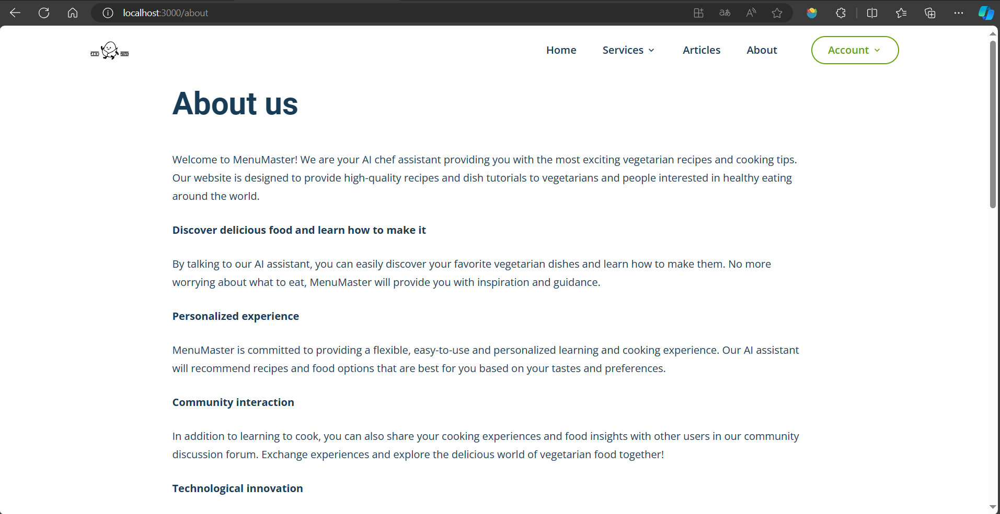

# Menu Master

## 1. Project Introduction

Welcome to MenuMaster! We are your AI chef assistant providing you with the most exciting vegetarian recipes and cooking tips. Our website is designed to provide high-quality recipes and dish tutorials to vegetarians and people interested in healthy eating around the world.

### Discover delicious food and learn how to make it
By talking to our AI assistant, you can easily discover your favorite vegetarian dishes and learn how to make them. No more worrying about what to eat, MenuMaster will provide you with inspiration and guidance.

### Personalized experience
MenuMaster is committed to providing a flexible, easy-to-use and personalized learning and cooking experience. Our AI assistant will recommend recipes and food options that are best for you based on your tastes and preferences.

### Community interaction
In addition to learning to cook, you can also share your cooking experiences and food insights with other users in our community discussion forum. Exchange experiences and explore the delicious world of vegetarian food together!

### Technological innovation
MenuMaster's technical architecture uses advanced technologies, including the JavaScript programming language, MongoDB database, and React.js and Tailwind CSS front-end builds. Even more exciting is that we have also integrated ChatGPT API to provide you with an intelligent AI assistant to help you answer questions, discover new recipes and learn cooking skills.

Whether you are a vegetarian, someone who wants to eat healthy, or just a regular person who wants to eat some vegetables, MenuMaster will bring you a joyful cooking experience and endless food exploration! Come join us and discover the delicious world of vegetarian food!

## 2. Project Features and Technologies
### Project features:

Personalized articles, recipe recommendations

Menu variety: There is an in-house article search, providing various articles to meet the needs of different users.

Intelligent AI assistant: Combines users' taste and dietary preferences to dynamically recommend suitable menus and cooking techniques.

Interactive cooking learning

Detailed cooking process: Users can learn the detailed cooking steps of dishes through the AI assistant.

Improve cooking skills: Help users improve their cooking skills through interactive teaching and enjoy the joy of cooking.

### Technologies:

For this project, we first used figma to design the UI of the front-end page. Then implement the front-end code based on the designed UI.


Through this project, the project has used React as front-end web application framework and Node.js as the backend. Tailwind css was used for user interface styling. For the search result, ChatGPT API was invoked to get customized menu recommendations. For easier and static access, we have registered a domain name menusmaster.com to host the project. For backend, we have set up MongoDB Atlas to interact with the backend to store data. As a developing solution, we are setting up API Gateway to act as a gateway for APIs and Lambda as target to interact with Databases. 


For Version control, we have used Github to host source code then Amazon Web Services(AWS) for App build, deploy and hosting. And by installing AWS Amplify agent on Github, it ingest the commit to the main branch of the repository and achieves Continuous Integration and Continuous Development (CI/CD) integration. upon each commit will trigger a build then deployment to update the website. 

For user management we are using AWS Identity and Access Management (Identity center) to manage users in our team, and we are using MongoDB Atlas to manage app user sign up and sign in. 

For security aspect, we have used AWS Organizations to manage the AWS accounts by separating the environments, CloudWatch was used for monitoring the application and provide metrics, etc. GuardDuty is for any suspecious activities such as DDoS attack, etc. Identity and Access management (identity center) is used for managing users by granting approprate permissions and set up MFA.

From project management perspective, we followed Agile methodology for this project and had weekly sprints, etc. we have used Trello as our main tool to manage tasks and update feature requirements. We used Zoom and Wechat for meeting and discussions. We have used Figma as our design tool to design and manage the front end pages.


### Architecture design:


## 3. Project Setup

Firstly, you can clone the git address of the git repository or download the project.
Download .env file submitted on google form which contains the sensitive information. The. env file should be placed in ..\project-group-vibrant-vipers\backend folder.
And then open the project root folder in the terminal. The environment in your machine should have Node.js, you can download via this link: 
[Node.js](https://nodejs.org/en/download)
, and this project also use React, you can follow this link: 
[React](https://react.dev/learn/installation)
 for installation, and you also need to install yarn via this link: 
[Yarn](https://classic.yarnpkg.com/en/docs/install#windows-stable)
 .

Then to start the frontend, use these commands in the terminal:
```
cd frontend
yarn
yarn start
```

You should see the frontend code running on 
'''
localhost:3000
'''

Then to start the backend,  go back to the project root folder and use these commands in the terminal:
```
cd backend
yarn
yarn start
```

You should see the server running on port 6000.

## 4. Project Screenshot

After successfully starting the frontend and backend of the project, you should be able to see the following pages:

Home Page:


Menus Master Page under Service:


Article Page:


Article Details Page (e.g Why Choosing Vegetarian at the Cafeteria Can Help the Planet):


Login Page:


Register Page:


Profile Page after login:


About Page:


## 5. Test

After thorough manual testing and user acceptance testing, our project has proven the effectiveness of its functions and user satisfaction. During the manual testing phase, our team conducted detailed testing on the functions we wanted to achieve, successfully fixed some bugs, and ensured the stability and good performance of the software. During the user acceptance testing phase, we selected some classmates (about 30 people) as target users and verified the practicality of the project in a real-world usage environment. The feedback showed that users were very satisfied with the application's ease of use, stability, and overall user experience. These test results demonstrate the reliability of our product and reflect that our design and development process can achieve our desired goals.

## 6. Others
Trello:


AWS:
Amplify host:


Amplify deploy:


API Gateway:


AWS CloudWatch Monitoring:


mongoDB Atlas Database: 


mongoDB Compass / Studio 3T: 


Figma:
